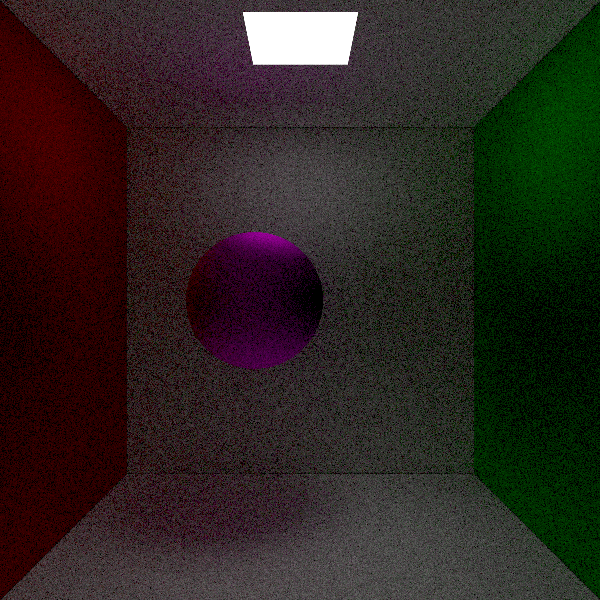

# pathtracer
Implementation of a path tracer in Rust. This is a personal project, mostly for learning Rust and what goes into a path tracer. I will also track the time it takes me to complete the project.

## Target structure
```
path_tracer/
├── Cargo.toml
├── src/
│   ├── main.rs              // Entry point, CLI, image output
│   ├── lib.rs               // Main library file (optional)
│   ├── scene/
│   │   ├── mod.rs
│   │   ├── camera.rs
│   │   ├── geometry.rs      // Sphere, triangle, BVH, etc.
│   │   └── material.rs
│   ├── render/
│   │   ├── mod.rs
│   │   ├── integrator.rs    // Path tracer core
│   │   ├── sampler.rs       // Random number generators
│   │   └── film.rs          // Accumulate, tone-map, write output
│   ├── math/
│   │   ├── mod.rs
│   │   ├── vec3.rs          // Vector operations
│   │   ├── ray.rs
│   │   └── bounding_box.rs
│   └── util/
│       ├── mod.rs
│       └── logger.rs        // Optional debug/logging
```

## 🪜 Milestones / Roadmap

### 1. 🧱 Basic Infrastructure
- [x] Set up a Rust project with cargo init.
- [x] Implement a simple Vec3 type.
- [x] Define a Ray type.
- [x] Implement basic scene description: a few spheres and a camera.
- [x] Output image as .ppm or use image crate for .png.

**Milestone Output:** A simple raytraced scene with colored spheres.

### 2. 🪞 Simple Whitted-style Ray Tracer
- [x] Implement ray-object intersections.
- [ ] Support Lambertian shading, shadows, and reflections.
- [x] Build basic material system using traits.
- [x] Add support for ~~point lights or~~ area lights.

**Milestone Output:** Shiny balls with shadows and reflections.

### 3. 🔁 Monte Carlo Path Tracing Core
- [x] Implement cosine-weighted hemisphere sampling.
- [ ] Basic path tracing integrator.
- [ ] Russian Roulette for recursion termination.
- [x] Add emissive surfaces for lighting (area lights).

**Milestone Output:** Global illumination with soft shadows and indirect light.

### 4. 🌲 Scene Complexity & Acceleration
- [ ] Add triangle mesh support.
- [ ] Build a simple BVH acceleration structure.
- [ ] Allow .obj or custom scene file loading.

**Milestone Output:** Complex scenes (e.g., Cornell Box) rendering in acceptable time.

### 5. 🧠 Importance Sampling, BRDFs
- [ ] Implement different BRDFs (Lambert, Glossy, Dielectric).
- [ ] Improve importance sampling for BRDFs and lights.
- [ ] Potentially use MIS (Multiple Importance Sampling).

**Milestone Output:** Physically plausible materials (glass, metal, plastic).

### 6. 🌈 Misc / Advanced Stuff
- [ ] Implement a film buffer with filtering.
- [ ] Apply gamma correction or Reinhard tone mapping.
- [ ] Add support for depth-of-field, motion blur.
- [ ] Spectral rendering (as in Fascione/Hanika’s notes).
- [ ] Use SIMD or threading (e.g., rayon).


## Work hours
Can I finish everything within 24 work hours?
| Date | Hours | Changes |
|------|-------|---------|
| 2025/06/15 | 1 | Initialization; `Vec3`
| 2025/07/01 | 1 | Image rendering, `Ray`, `Sphere`
| 2025/07/02 | 5 | `Camera`, First render, `Material`, `Lambertian`
| 2025/07/03 | 1 | `Emissive`, cosine-weighted hemisphere sampling
| 2025/07/04 | 1 | `Plane` (or Circle for now), fixed cosine-weighted hemisphere sampling, anti-aliasing
| 2025/07/05 | 1 | fixed `Plane` intersection, implemented Cornell box

## Current render
